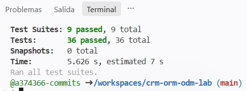

# CRM ORM/ODM Lab

API REST de un CRM básico que combina un ORM (Sequelize + PostgreSQL) y un ODM (Mongoose + MongoDB). Los usuarios, compañías y contactos se guardan en PostgreSQL; las actividades se guardan en MongoDB.

## Stack

- Node.js 22, Express 5 y CommonJS
- Sequelize y PostgreSQL 16 para `User`, `Company` y `Contact`
- Mongoose y MongoDB 7 para `Activity`
- Jest y Supertest para las pruebas
- GitHub Codespaces, Dev Containers, Docker Compose y Supervisor (`npm run dev`)

## Arquitectura

La API conecta con dos motores de datos. Docker Compose ofrece los servicios `postgres` y `mongo`; dentro de la red del contenedor esos nombres sirven como hosts de base de datos.

```text
GitHub Codespace / aplicación Node.js
├── Sequelize (ORM) ──> postgres (PostgreSQL)
│                       ├── User
│                       ├── Company
│                       └── Contact (companyId)
└── Mongoose (ODM) ───> mongo (MongoDB)
                        └── Activity (metadata flexible)
```

## Iniciar el Codespace

1. Abre tu fork en GitHub y crea o inicia un Codespace desde la rama `main`.
2. Espera a que termine de construirse. El entorno levanta los contenedores `app`, `postgres` y `mongo`, e instala las dependencias.
3. Abre una terminal en la raíz del repositorio.

## Instalar dependencias

Codespaces ejecuta `npm install` durante la preparación inicial. Si necesitas reinstalar las dependencias, ejecuta en la terminal:

```bash
npm install
```

## Seed y reset

Para cargar los datos de prueba iniciales manualmente, ejecuta:

```bash
npm run seed
```

Para restablecer las bases de datos al estado inicial, ejecuta:

```bash
npm run reset
```

Cada suite de pruebas también restablece sus datos; por eso los registros creados manualmente se pierden al ejecutar `npm test`.

## Iniciar la API

```bash
npm run dev
```

La API escucha en el puerto 3000. Codespaces reenvía ese puerto para que puedas consultar los endpoints; el script de desarrollo usa Supervisor para ejecutar y reiniciar la aplicación.

## Pruebas

```bash
npm test
```

Jest ejecuta las pruebas de comportamiento con Supertest. `tests/setup.js` conecta Sequelize y Mongoose y restablece las bases de datos al iniciar cada suite; al terminar, cierra ambas conexiones.

## Endpoints

La API está disponible en el puerto 3000. Los recursos `users`, `companies`, `contacts` y `activities` tienen operaciones CRUD:

| Método | Ruta | Acción |
| --- | --- | --- |
| GET | `/health` | Comprueba el estado del servicio. |
| GET | `/{recurso}` | Lista los registros. |
| GET | `/{recurso}/:id` | Busca un registro por ID. |
| POST | `/{recurso}` | Crea un registro. |
| PUT | `/{recurso}/:id` | Actualiza un registro. |
| DELETE | `/{recurso}/:id` | Elimina un registro. |

Sustituye `{recurso}` por `users`, `companies`, `contacts` o `activities`; por ejemplo, `GET /companies` y `POST /activities`.

## Respuestas

### 1. Dos motores

`Company` y `Contact` tienen campos relacionados y una llave foránea, así que encajan en PostgreSQL (`models/sequelize/index.js`). `Activity` puede guardar detalles distintos según el evento, por eso MongoDB y el campo flexible de `models/mongoose/activity.js` son adecuados.

### 2. ORM vs ODM

Un ORM relaciona modelos del programa con tablas y filas; un ODM los relaciona con documentos. En este proyecto uso Sequelize para PostgreSQL y Mongoose para MongoDB, como se ve en `models/sequelize/` y `models/mongoose/`.

### 3. Configuración por variables de entorno

La aplicación lee la configuración con `process.env`; `DB_HOST` indica el host de PostgreSQL y `MONGODB_URI` contiene la conexión de MongoDB (`config/`). Las credenciales se definen en el entorno de Codespaces y no dentro de archivos `.js` para evitar exponerlas o subirlas al repositorio. Docker usa los nombres de servicio `postgres` y `mongo` como hosts; `localhost` señalaría al contenedor de la aplicación.

### 4. Asociaciones

En `models/sequelize/index.js`, una compañía tiene muchos contactos y cada contacto pertenece a una compañía. La llave foránea `companyId` vive en `Contact`; el alias `contacts` nombra la colección que se incluye al consultar una compañía.

### 5. Eager loading

En `controllers/companies.js`, `getById` puede usar `include` con el alias `contacts` para obtener la compañía y sus contactos en una sola consulta asociada. Consultarlos por separado requiere otra llamada a la base de datos y ensamblar la respuesta manualmente; `include` mantiene los contactos ligados a su compañía.

### 6. Instancia vs consulta

En `controllers/contacts.js`, `update` busca primero con `Contact.findByPk` y modifica la instancia; así puede responder con el contacto actualizado o detectar que no existe. `Contact.update(datos, { where })` actualiza por filtro y devuelve normalmente el número de filas afectadas, no la instancia actualizada.

### 7. Esquema flexible

`models/mongoose/activity.js` usa `Schema.Types.Mixed` para `metadata`, así CALL puede guardar duración, EMAIL asunto y MEETING lugar o asistentes. Esa flexibilidad evita fijar los mismos campos para todos, aunque Mongoose valida menos la estructura interna que con campos tipados.

### 8. Sin ref. contactId y userId

En `models/mongoose/activity.js`, `contactId` y `userId` son números, no referencias Mongoose a modelos de PostgreSQL. `populate` no conecta automáticamente dos motores; si se borra un usuario o contacto, la actividad puede conservar su ID sin un registro correspondiente.

### 9. Documento actualizado

En `controllers/activities.js`, `update` usa `findByIdAndUpdate`. Sin `{ new: true }`, Mongoose devuelve el documento anterior; con esa opción, la respuesta contiene el documento actualizado. `runValidators: true` hace que Mongoose valide los valores con el esquema.
### 10. Pruebas de comportamiento

Las suites `tests/challenge01.test.js` a `tests/challenge08.test.js` envían solicitudes y verifican respuestas y cambios persistidos. Así comprueban lo que observa quien usa la API y permiten cambiar la implementación mientras se conserve el comportamiento esperado.

### 11. Repetibilidad

`tests/setup.js` conecta PostgreSQL y MongoDB y llama a `reset()` antes de cada suite; al terminar cada una, cierra ambas conexiones. El reset deja datos conocidos en los dos motores, de modo que una suite no depende de los cambios de otra ejecución.

### 12. Mi experiencia

El reto 08 fue de los más difíciles: `tests/challenge08.test.js` mostraba que el PUT guardaba el cambio, pero respondía con la descripción anterior. En `controllers/activities.js` agregué `{ new: true }` a `findByIdAndUpdate` para responder con el documento actualizado.

## Evidencia

Test Suites: 9 passed, 9 total
Tests: 36 passed, 36 total


